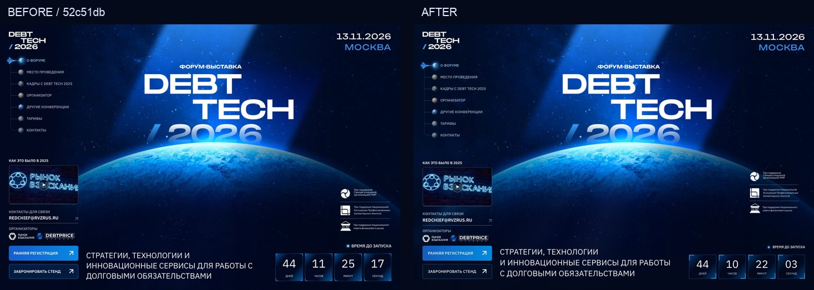
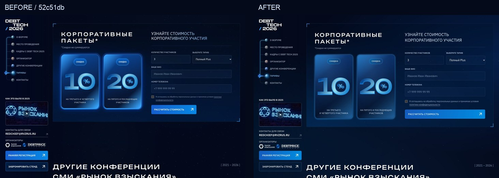
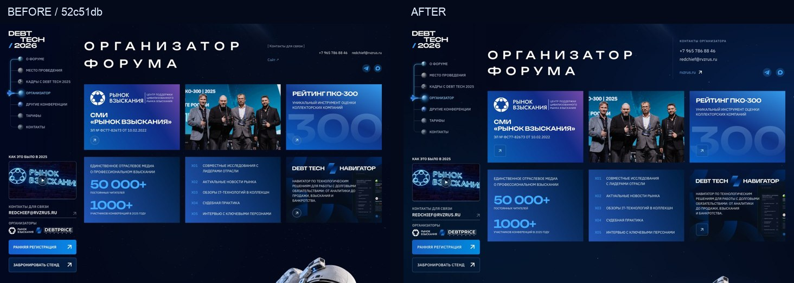
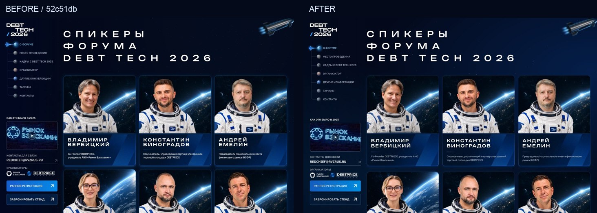
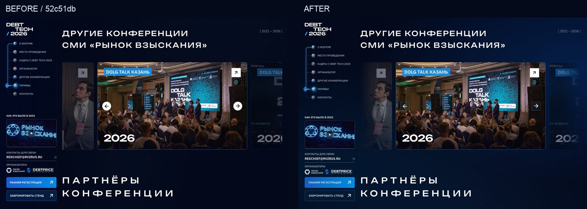

# DEBT TECH — повторная визуальная проверка и motion-pass

29 сентября 2026. База сравнения: `52c51db`. Эталон: первоначальное изображение макета и исходный фрейм Figma `1129:22497` (1440 × 17408), а не новые стилистические референсы.

## Изменения по замечаниям

**Первый экран.** Высота зависит от реального окна. На десктопе изображение, логотип, описание и таймер привязаны к полному первому экрану; бегущая строка находится ниже его границы. На небольших устройствах контент остаётся в потоке и при необходимости занимает больше одного экрана, а не обрезается ради фиксированной высоты.

**Левое меню.** Между логотипом и навигацией увеличен интервал. Сильная непрозрачная подложка заменена полупрозрачным оттенком и шестью слоями прогрессивного backdrop blur: сильнее слева, плавно исчезает справа. Слои вынесены отдельно от содержимого меню, чтобы маска не обрывала размытие под ними.

**Типографика.** Добавлен Typograf на этапе сборки. Выбраны только правила неразрывных пробелов для коротких слов: одобренные формулировки, URL, идентификаторы форм и тарифные данные не переписываются. В браузер библиотека не попадает. У цифр в переключателе программы и статистике устранена отрицательная/слишком тесная высота строки.

**Кнопки.** Два оформления — заполненное и контурное — определяются одним набором токенов. У CTA общие интервалы, внутренние отступы, радиусы, начертание и стрелки. Регистрация, формы, тарифы и левое меню используют те же правила. У кнопок с одной иконкой — контурное оформление и отдельная квадратная геометрия 44 × 44. Кнопка интервью больше не растягивается без необходимости.

**Спикеры.** Проверены исходный портретный кадр, пропорции верхней части карточки, отступы имени и должности, межстрочные интервалы и разделитель. Убрано избыточное свечение. В статусном баннере восстановлены скругления, верхний разделитель, градиент текста и крупный шлем справа; вместо уменьшенной общей иллюстрации взят прозрачный исходник соответствующего объекта Figma.

**Тарифы.** Увеличен основной текст, выровнен ритм всех трёх карточек. На промежуточных планшетных ширинах список возможностей раскладывается в две колонки, цена и CTA — в нижнюю строку. Добавлены тихое свечение, реакция на курсор и мягкое движение декора без изменения размеров карточек.

**Корпоративные пакеты.** Правая и левая колонки имеют общие верхнюю и нижнюю линии. Кнопка формы совпадает по нижней границе с карточками скидок. Карточки больше не задают всей секции излишнюю высоту через жёсткое соотношение сторон; цифры и подписи остаются внутри безопасных отступов. На телефонах блок последовательно складывается в одну колонку.

**Организатор.** Контакты объединены в отдельный семантический блок: подпись, телефон, e-mail и нижняя строка сайта/каналов. Для карточек зарезервирована высота под текст и интерактивные элементы; исправлено пересечение соседних карточек на узком десктопе.

**Другие конференции.** По краям карусели применено постепенное исчезновение через альфа-маску. Кнопки управления находятся вне маски и не теряют контраст. Исходные фотографии и содержание карточек сохранены.

## Анимации и фон

Общий звёздный фон теперь процедурный CSS: три слоя небольших точек через `box-shadow` и мягкие радиальные свечения. Большая картинка звёзд для фона страницы не используется. Планета первого экрана и сюжетные иллюстрации сохранены как часть исходного дизайна.

Курсор и прокрутка с небольшим сглаживанием смещают слои фона. Обработчики пассивные; расчёты положения ограничены одним кадром, а после достижения целевого положения JavaScript-цикл останавливается. На сенсорных устройствах не используется движение за курсором, один декоративный слой отключён.

Появление заголовков и карточек выполняется через IntersectionObserver и Web Animations API. Элементы не находятся в скрытом состоянии до срабатывания JavaScript. Hover-эффекты не меняют поток документа; фотографии увеличиваются внутри своих рамок. Постоянное движение можно остановить кнопкой паузы. Системная настройка `prefers-reduced-motion` отключает фоновые и входные анимации, а скрытая вкладка приостанавливает CSS-анимации.

## Проверка

Геометрия проверена в **72 комбинациях**: Chromium 154.0.8037.58, Firefox 153.0 и WebKit 26.6, по 24 ширины в каждом движке. Все 72 комбинации прошли проверку. [Полные результаты](experience-audit/browser-matrix.json).

Ширины: 320, 360, 390, 430, 599, 600, 699, 700, 767, 768, 849, 850, 899, 900, 1024, 1180, 1181, 1280, 1366, 1440, 1600, 1920, 2048, 2560 px. Дополнительно проверяются разные высоты первого экрана, а не только ширина браузера.

Пройдены **42 E2E-сценария и 8 модульных тестов**. Дополнительно к прежним сценариям проверяются полноэкранный hero, неразрывные пробелы, общие линии корпоративного блока, прогрессивное размытие, типографика цифр, восстановленный баннер, мягкие края слайдера, реакция фона, пауза, уменьшенное движение и работа меню/форм с включёнными анимациями.

Проверки заявок перехватывают запросы к API: настоящие тестовые обращения организаторам не отправляются. Серверная конфигурация приёма заявок и основной домен этим изменением не затрагиваются.

## До / после

Слева — предыдущая опубликованная версия `52c51db`, справа — текущий проход. Сравниваются браузерные окна, а не растянутые изображения сайта.

### Первый экран

### Корпоративное участие

### Организатор

### Спикеры

### Архив конференций

## Воспроизведение

`npm test` — модульные тесты. `npm run test:e2e` — интерфейс, включая движение и ошибки форм. `npm run audit:visual` — геометрическая матрица трёх движков. `node scripts/inspect-experience.mjs` — снимки проблемных блоков на разных ширинах и высотах. Для двух последних команд сначала запускается dev-сервер; доступны `QA_BASE_URL`, `QA_OUTPUT` и переменные путей к браузерам.

Это проверка браузерных движков и указанных размеров, а не физический прогон на каждой модели телефона. Производительность зависит от устройства; фиксированная частота кадров для всех устройств не заявляется.
