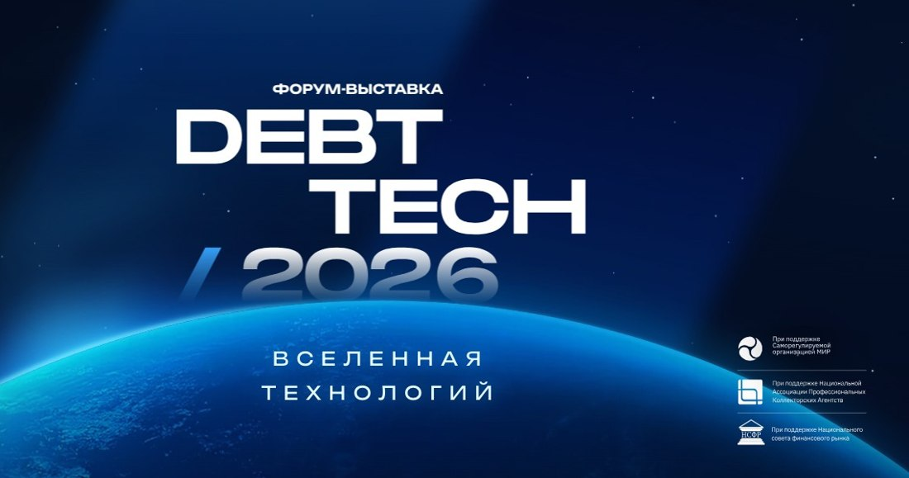
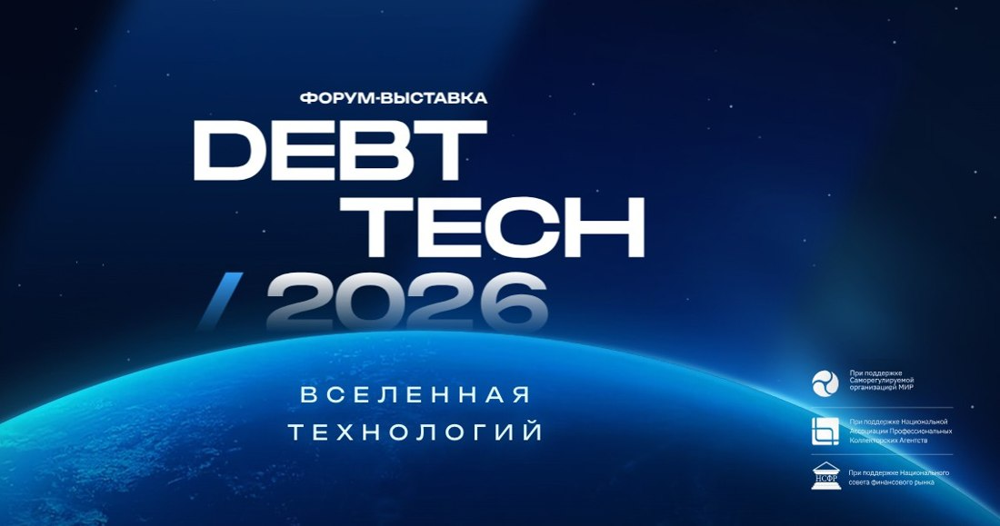
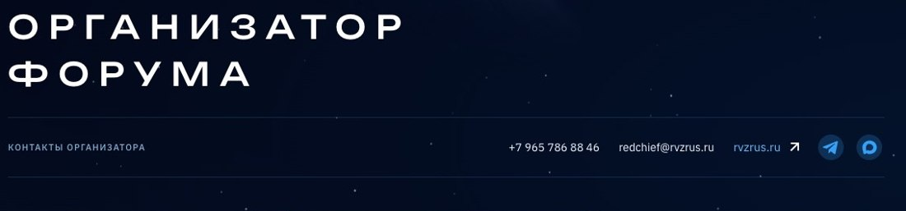
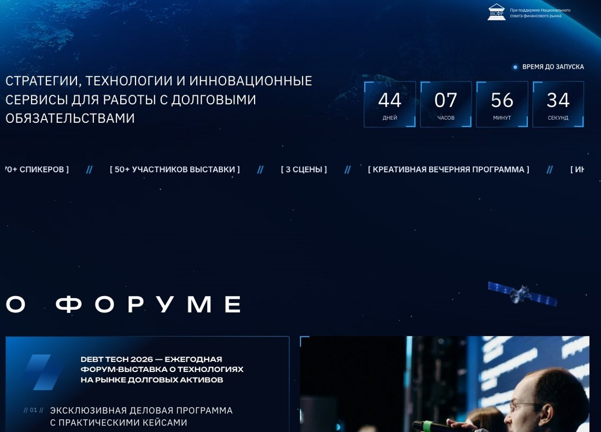

# DEBT TECH — отзывчивость первого экрана и плавность прокрутки

База: `4402d86`. Этот проход меняет рендеринг и взаимодействия, а не концепцию сайта. Планета, логотип, исходные иллюстрации, прелоадер, muted-autoplay видео и предложение раннего бронирования сохранены.

## Исправления

**Реакция на курсор.** Подсветка вдоль окружности планеты теперь перемещается за курсором и заметно усиливается при наведении. Положение самой окружности остаётся общим с планетой, в том числе на адаптивах. Устранена мёртвая зона событий поверх левого меню: события указателя обрабатываются для видимой сцены целиком.

**Нагрузка шейдера.** Вместо 12 шагов объёмного расчёта с несколькими октавами трёхмерного шума используется аналитическая атмосфера с двумя выборками двумерного шума. Невидимая область под планетой исключается из расчёта сразу. Буфер ограничен примерно 150 тысячами пикселей на десктопе и 90 тысячами на телефоне; указатель обрабатывается с плавным сглаживанием. При выходе первого экрана из видимости, открытии модального окна и скрытии вкладки отрисовка останавливается.

**Прокрутка меню.** Удалён JS-цикл, который каждый кадр повторно запускал smooth scroll. Теперь переход — один нативный вызов. Координаты разделов кэшируются и пересчитываются при изменении размеров, а не читаются из DOM на каждом кадре прокрутки.

**Актуальные пункты.** Меню связано с реальными разделами в порядке страницы: «О форуме», «Программа и форматы», «Услуги участникам», «Ключевые темы», «Спикеры», «Организатор», «Тарифы», «Другие конференции», «Партнёры», «Контакты». Галерея 2025 года осталась отдельной ссылкой «Фото» рядом с видео. Это не несуществующий раздел, влияющий на подсветку текущего пункта.

**Переход из hero.** Нижняя часть слоистой сцены постепенно становится прозрачной над общим живым фоном. Больше нет завершения непрозрачным прямоугольником. По краям бегущей строки тоже добавлено мягкое исчезновение.

**Появления.** Карточки заранее подготавливаются за пределами экрана и затем плавно проявляются с небольшим вертикальным смещением. Начальная подготовка не анимирует обратное исчезновение. Уже показанный элемент не скрывается снова. Изображения загружаются и декодируются заранее, с очередью максимум из двух одновременных подготовок, чтобы не запускать декодирование всей секции в момент её появления.

**Живой космос.** У звёздных слоёв увеличена амплитуда и скорость непрерывного движения, добавлено движение мягкого фонового свечения. Реакция на курсор и скролл меняет непосредственно transform слоёв, а не наследуемые CSS-переменные. Для карточек аудитории и информационных партнёров убраны независимые backdrop-проходы; прогрессивное размытие меню сохранено тремя слоями вместо шести.

**Видео.** Убраны рамка, тень и увеличение рамки при наведении. Край iframe слегка подрезан внутри контейнера, чтобы убрать однопиксельный шов. Автоматическое воспроизведение без звука не отключено.

**Контакты организатора.** На десктопе в общей горизонтальной строке находятся подпись, телефон, e-mail, сайт и каналы связи — не только телефон с почтой. Проверяется совпадение вертикальных центров всех элементов.

**Формы и слайдеры.** У всех полей `participants_count` скрыты нативные стрелки браузера; числовой тип и ограничения остаются. В карусели конференций кэшируются положения карточек, а быстрые повторные нажатия не сбрасывают выбранную цель на промежуточную карточку. Управление стрелками, клавиатурой и прокруткой сохранено.

## Замер выполнения, а не только геометрии

Контрольный сценарий: Chromium 154, окно 1440 × 900, DPR 1, включённые анимации; 6 секунд движения указателя и 12 секунд прокрутки до 16000 px. Видеоплеер заменён заглушкой **только в измерении**, чтобы сеть и декодирование внешнего ролика не искажали сравнение собственного кода сайта. Сайт при этом использует настоящий плеер.

| Показатель | До | После |
| --- | ---: | ---: |
| Перерасчёт CSS при движении указателя | 882 мс | 101 мс |
| Перерасчёт CSS при прокрутке | 1874 мс | 531 мс |
| 95-й перцентиль интервала кадров при движении указателя | 33,3 мс | 16,7 мс |
| 95-й перцентиль интервала кадров при прокрутке | 33,3 мс | 16,8 мс |
| Интервалы кадров дольше 50 мс в финальном прогоне | — | 0 |

Снижение измеренного времени перерасчёта CSS: **88,5% для указателя и 71,7% для прокрутки**. [Исходный замер](fluidity-audit/before-benchmark.json) и [финальный замер](fluidity-audit/after-final-benchmark.json) включают длительности, максимальные интервалы и параметры окружения. Это один воспроизводимый контрольный прогон, а не гарантия фиксированной частоты кадров на любом устройстве.

## Проверки и воспроизведение

**72 из 72 комбинаций размеров и движков прошли геометрическую проверку:** Chromium 154, Firefox 153 и WebKit 26.6, по 24 ширины от 320 до 2560 px. [Матрица проверки](fluidity-audit/browser-matrix.json).

Сценарии проверяют текущие якоря меню, горизонтальную строку контактов, отсутствие рамки видео и спиннеров, один вызов нативной прокрутки, монотонное появление карточек, перемещение светового акцента и остановку рендера вне экрана и под модальным окном. Сохранены прежние проверки форм, тарифов, прелоадера, баннера, переключателей и галереи.

`npm test` — модульные тесты. `npm run test:e2e` — интерфейс. `npm run audit:visual` — матрица размеров в Chromium, Firefox и WebKit. `node scripts/benchmark-runtime.mjs` — описанный контрольный сценарий; сначала нужен dev-сервер. Доступны `QA_BASE_URL`, `QA_LABEL`, `QA_OUTPUT` `QA_DPR` и `PLAYWRIGHT_CHROMIUM_EXECUTABLE_PATH`.

Основной сервер и контракты отправки форм не изменены. Тесты перехватывают отправку заявок и не создают настоящих обращений. Системное уменьшение движения учитывается; плавающая кнопка play/pause не возвращалась.

## Визуальная проверка

Световой акцент с указателем слева и справа:

Контакты одной строкой:

Переход из первого экрана:

## Технические ориентиры

Использованы рекомендации [Chrome/web.dev по производительным анимациям](https://web.dev/articles/animations-guide), [MDN по бюджету WebGL-буфера](https://developer.mozilla.org/en-US/docs/Web/API/WebGL_API/WebGL_best_practices) и [MDN по отложенной загрузке](https://developer.mozilla.org/en-US/docs/Web/Performance/Guides/Lazy_loading). Эти материалы описывают подход; фактические результаты этого сайта приведены отдельно выше.
