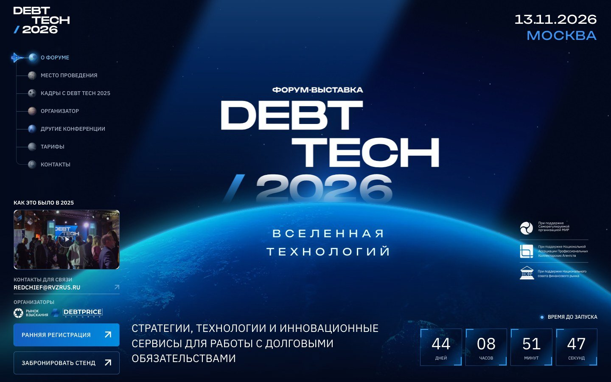
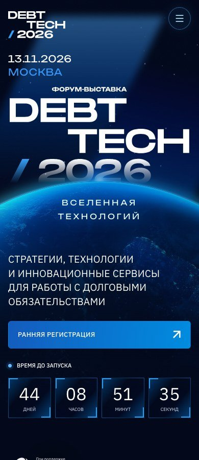
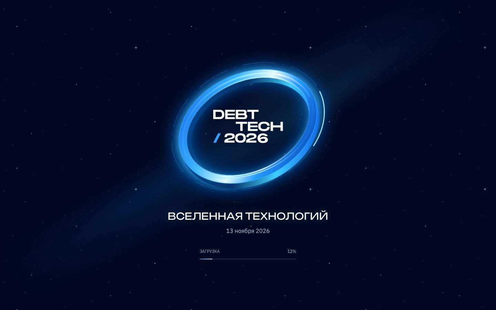
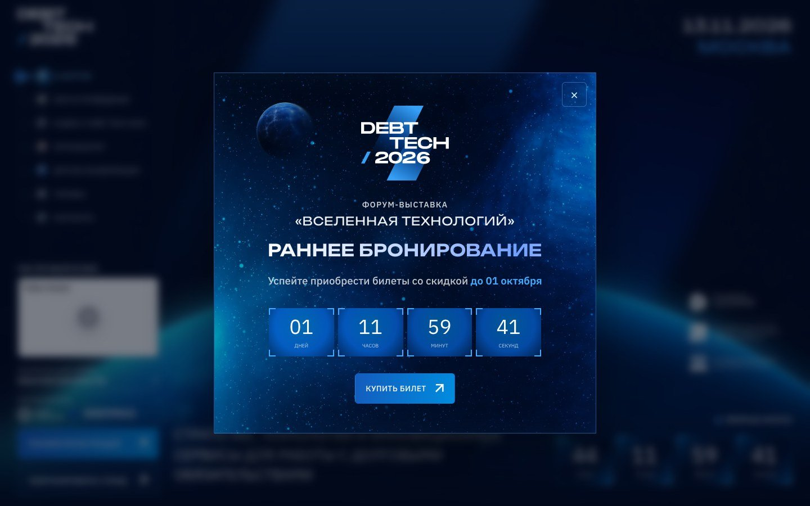
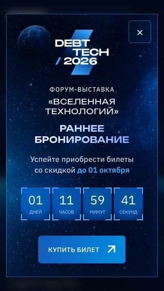
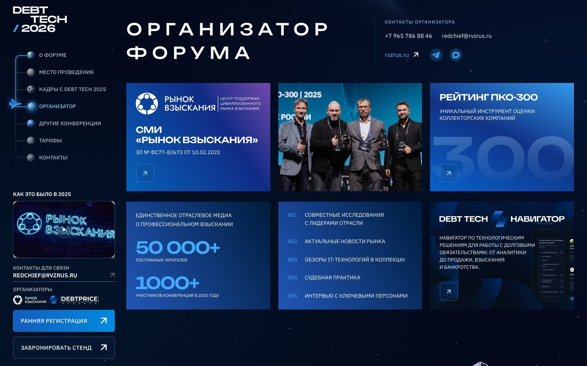

# DEBT TECH — слоистый первый экран и исправление анимаций

29 сентября 2026. Базовая версия — `ee4731a`. Новый первый экран собран по архиву `DEBT_TECH 2026 (4) 2.zip` и ролику `536 (1) (1).mp4`. Остальная страница сохраняет существующий дизайн.

## Первый экран

Используются отдельные слои, а не анимация скриншота: адаптированный шейдер Orbit; прозрачное поле звёзд; размытый бренд-элемент; SVG-логотип с надписями; вращающаяся планета; неподвижная световая корона; надпись «Вселенная технологий». Описание форума, дата, поддерживающие организации и обратный отсчёт остаются HTML.

Планета делает полный оборот за 480 секунд. Вращается внутренняя текстура, а её круглая оболочка остаётся неподвижной. Положение световой короны и геометрия шейдера привязаны к этой же оболочке: ширина, центр и высота горизонта не вычисляются независимыми приближениями для разных адаптивов. У исходного свечения убрано только пустое прозрачное поле снизу; положение его дуги согласовано с окружностью планеты.

Предоставленный Orbit-код адаптирован в `src/components/hero/orbit-shaders.js` и `OrbitGlow.jsx`. Цвета переведены в сине-голубую палитру, позиция окружности не зависит от движения курсора. Курсор влияет на свет, но не сдвигает край планеты относительно её изображения. Исходный предоставленный код сохранён в [Orbit-source.txt](hero-audit/Orbit-source.txt).

Мягкому фоновому свету не требуется полноэкранное разрешение: WebGL ограничен 210 тысячами пикселей на десктопе и 120 тысячами на узких экранах, с 12 шагами интегрирования и частотой отрисовки до 30 кадров/с. Текст, SVG-логотип и сама планета от этого ограничения не теряют резкость. Когда первый экран не виден, цикл WebGL останавливается. При отсутствии или потере WebGL используется CSS-подсветка с той же окружностью.

## Звёзды и переходы

Плавающей кнопки play/pause больше нет. Поля звёзд — прозрачные CSS-слои с непрерывным движением и сглаженной реакцией на курсор и прокрутку. Глобальные свечения не подменяют прозрачный звёздный слой первого экрана.

Устранена причина мерцания предыдущего прохода: видимые элементы больше не переводятся обратно в пониженную прозрачность. Появление выполняется один раз для целой сетки, с небольшим смещением и неизменной непрозрачностью. Нет одновременно анимирующихся родительских и дочерних карточек, независимых задержек каждого текста и повторных скрытий при прокрутке назад.

Декоративные эффекты учитывают `prefers-reduced-motion` и приостанавливаются в скрытой вкладке. Наведение на кнопки и тарифы добавляет слабую космическую подсветку, не меняя размеры и положение соседних элементов.

## Видео и контакты

Видео в десктопном меню автоматически запускается без звука и повторяется. Постер остаётся резервным слоем. Проверено фактическое состояние плеера, а не только URL: `muted=true`, `paused=false`, `readyState=4`; время воспроизведения увеличилось с 4,15 до 6,36 секунды. Внешний плеер по-прежнему зависит от доступности сервиса и политики браузера.

Телефон и e-mail организатора расположены в одной строке. Это проверяется на ширинах 320, 390, 600, 768, 900, 1181 и 1440 px. Дополнительно исправлен типограф: пробелы перед выделенным текстом и ссылками не исчезают, а значения HTML-атрибутов и доступные подписи не превращаются в буквальные escape-последовательности.

## Прелоадер и баннер через 15 секунд

Прелоадер перенесён из `main` репозитория `IMONsergey/debt-2026-lite`, коммит `7aa0369bbdf286eddfe075ddf86de82409adb325`: светящееся кольцо, логотип, название, дата, прогресс и плавный выход. Прогресс подключён к загрузке новых hero-ассетов и шрифтов. Содержимое разблокируется после завершения выхода; ошибка загрузки картинки не оставляет страницу навсегда закрытой.

В проверенном `main` нет исходника 15-секундного баннера. Нужный вариант найден на действующем `debt-tech.ru`; его текст, оформление, фон, логотип, планета и дата окончания предложения восстановлены по опубликованной версии. Это не выдаётся за перенос отсутствующего компонента из Git.

Баннер открывается через 15 секунд, но не поверх ещё открытого прелоадера или активной формы/галереи. Сохранены раннее бронирование до 1 октября и обратный отсчёт. «Купить билет» закрывает окно и ведёт к тарифам. Работают Escape, закрытие по фону и ограничение фокуса внутри окна. Закрытое предложение не показывается повторно в текущей сессии; после окончания акции баннер не выводится.

## Проверки

Пройдены **51 E2E-сценарий и 9 модульных тестов**. Готовая production-сборка с путями `/debtupd/` проверена в **72 комбинациях**: Chromium 154, Firefox 153 и WebKit 26.6, по 24 ширины от 320 до 2560 px. Все 72 комбинации прошли проверку. [Машиночитаемые результаты](hero-audit/browser-matrix.json). Проверяются не только ширины, но и высоты первого экрана, общая окружность трёх слоёв, отсутствие понижения opacity при появлении сеток, фокус, 15-секундная задержка, истечение акции и мобильный баннер.

Настройки отправки заявок и основной сервер не изменены. В автоматических проверках запросы к `/api/lead` перехватываются: реальные заявки не создаются. Сохраняется ранее описанное ограничение CORS для прямой отправки с GitHub Pages.

## Материалы проверки

Скриншоты и машиночитаемая матрица находятся в папке `docs/hero-audit`. Это проверки браузерных движков и перечисленных размеров, а не прогон на каждой физической модели телефона. Частота кадров зависит от устройства; универсальное обещание 60 fps не даётся.

## Где менять

`src/components/hero/HeroScene.jsx` — порядок слоёв и загрузка критических ассетов. `hero-scene.css` — общая геометрия планеты и адаптивы. `OrbitGlow.jsx` — рендеринг света и бюджет нагрузки. `Cosmos.jsx` / `motion.css` — звёзды. `useExperienceMotion.js` — однократные появления. `TicketOffer.jsx` — баннер, срок и задержка. Прелоадер — `index.html`, `preloader.css` и `preloader-scene.js`.

## Снимки готовой сборки

### Новый первый экран — десктоп

### Новый первый экран — телефон

### Импортированный прелоадер

### Предложение раннего бронирования

### Баннер на 320 px

### Контакты организатора

