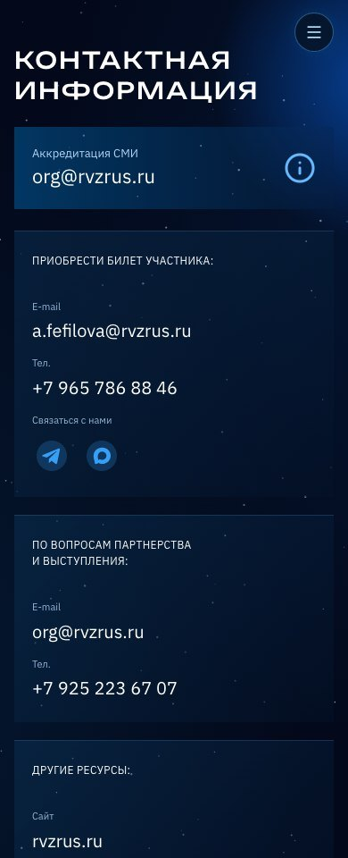
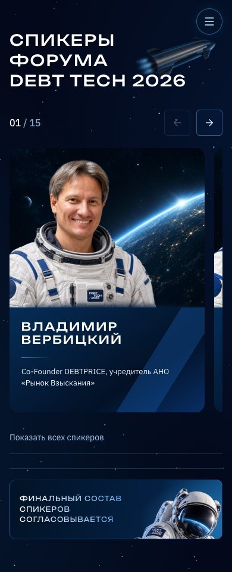
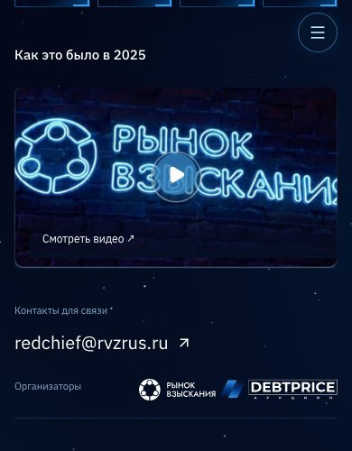
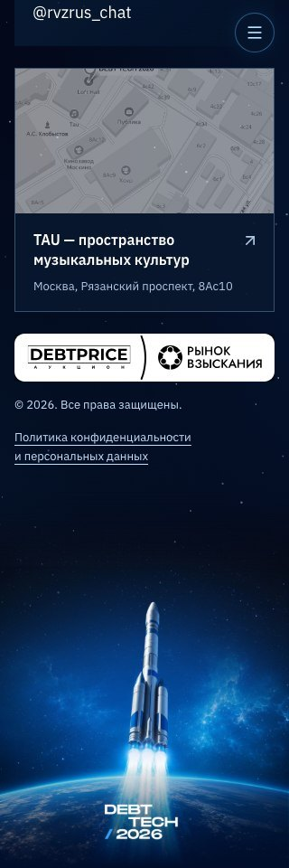
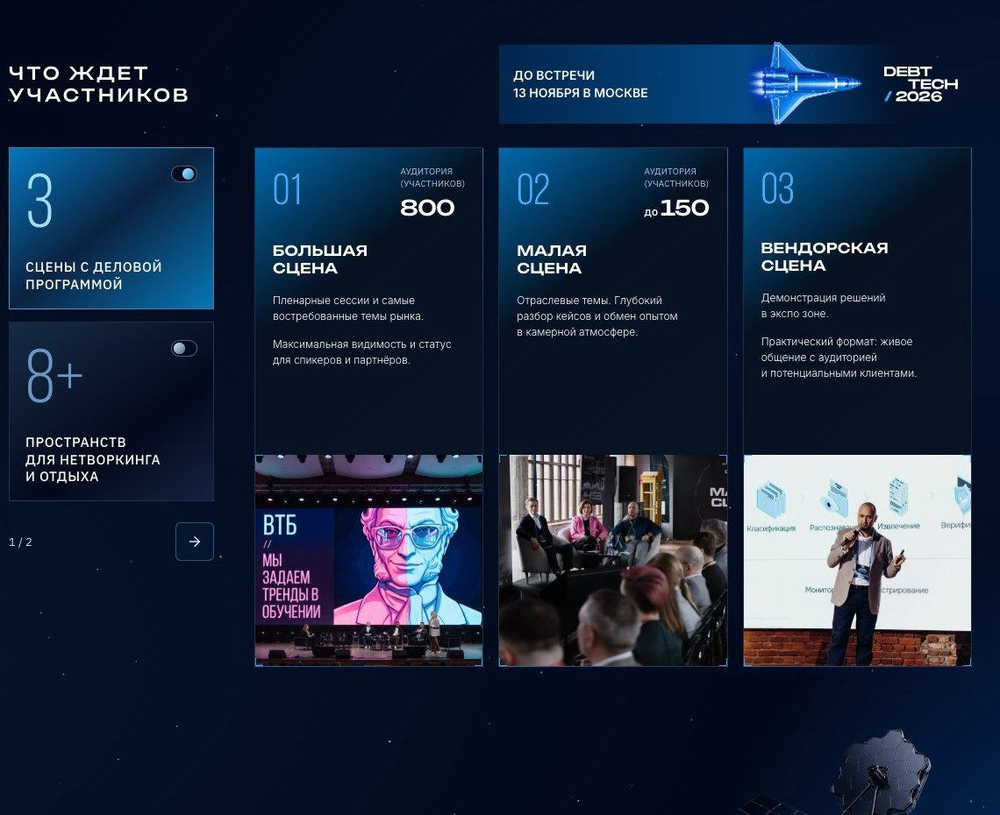

# DEBT TECH — замечания партнера и мобильная верстка

**Источники:** «Правки по дизайну сайта / DEBT TECH 2026», «Правки по адаптиву сайта / DEBT TECH 2026», пять мобильных снимков пользователя и актуальный макет [Page 20, фрейм 1777:22965](https://www.figma.com/design/lQfOm1SOxe7rAnLQdeCfpA/GPT-ASTRA-TEST?node-id=1777-22965). Базовая публикация: `a5e4cce`.

## Обработка комментариев

| Замечание | Что изменено |
| --- | --- |
| Низкое качество изображений | Портреты спикеров заменены кадрами 1071 × 876. Фотографии программы в обоих режимах — 1044 × 968, с использованием оригинальных изображений 1667–4096 px и кадрирования из Figma. Обновлены фото «О форуме» и услуг. Логотипы БО, ДА.Коллекшн, РАД и нижний блок организаторов переведены на имеющиеся SVG. Для остальных партнеров использованы доступные исходные изображения вместо маленьких экспортов. |
| Тусклые цвета | Восстановлены насыщенные синие углы и диагональные градиенты карточек, синие маркеры и подписи. Заливки аудитории и информационных партнеров сверены с Page 20. |
| Два лишних пункта меню | «Организатор» и «Другие конференции» остаются удаленными из меню. Сами разделы сохранены. |
| Первый экран: надпись, свет, поддержка | «Вселенная технологий» приведена к более тонкому начертанию и интервалам исходного дизайна. Добавлена центральная подсветка у логотипа. На десктопе блок поддержки опущен. На телефоне три знака собраны в компактную строку внутри первого экрана, до описания и кнопок. |
| Не работают две бегущие строки | Включена непрерывная CSS-анимация двух одинаковых копий, с бесшовным циклом. При системном уменьшении движения анимация намеренно отключена. |
| «Что ждет» и оформление программы | Используется Е. Вместимость показана отдельными блоками «Аудитория (участников) / 800» и «до 150». Исправлены разрывы заголовков. |
| Тематические зоны и развлечения | Список прописными, на отдельных синих полосах с наклонным бренд-элементом справа. Длинные слова не разбиваются произвольными дефисами. |
| Услуги | Исправлены цвета ///, инструкции и нумерации; подзаголовки помещаются в одну строку на десктопе и естественно переносятся на небольших экранах. |
| Ключевые темы | Цифры синие, между ними и заголовками увеличен отступ. |
| Спикеры | Ракета увеличена и смещена влево. У карточек нет обводки, тени и увеличения портрета при наведении, подразумевающих действие. Имена и должности остаются текстом. |
| Два новых спикера | После Андрея Емелина добавлен Александр Пустовит; после Евгении Уткиной — Денис Каюмов. Имена, должности и порядок сверены с макетом. Всего подтверждено 15 спикеров; будущие 30+ не подменены вымышленными карточками. |
| Плашка состава спикеров | Скругленная сине-черная полоса, градиентный текст с интервалами и крупный фрагмент космонавта справа. |
| Организатор | Подпись «Контакты для связи», восстановлена ссылка WhatsApp из уже утвержденных контактов. На десктопе сохраняется одна общая строка контактов. |
| Тарифы | «Стоимость*». Выбранный тариф открывает окно со своим названием, цветовым акцентом и текущей ценой; общий формуляр сохраняет прежний контракт отправки. |
| Партнеры | В заголовках и меню использована Е. |
| Контакты | Заголовок партнерства и выступлений разбит на две строки. Аккредитация — отдельная карточка с нормальными отступами текста и значка. |

## Отдельная мобильная переработка

Первый экран содержит компактную строку поддержки и две кнопки одинаковой ширины: ранняя регистрация, затем бронирование стенда. Дублирующая кнопка стенда под видео убрана. Видео, почта и логотипы организаторов собраны в связный компактный блок, без прежних больших вертикальных разрывов.

У карточек программы удален фиксированный резерв высоты текстовой части. На телефоне фотография следует за содержимым с нормальными отступами, а на узком планшете карточка раскладывается в текстовую и фотографическую половины. Скрытый режим больше не резервирует пустую высоту под выбранным. На узких телефонах длинные категории участников используют одну колонку, чтобы названия читались без обрезания. Переключение между сценами и пространствами сохранено.

До 900 px спикеры представлены нативным горизонтальным слайдером с частично видимой следующей карточкой, счетчиком, стрелками и клавиатурным управлением. Есть «Показать всех спикеров» для обычного списка. На десктопе остается сетка из трех колонок. Компонент принимает любое количество подтвержденных профилей.

Контакты сгруппированы по назначению. Карточка аккредитации занимает ширину контейнера. Карта и ее подпись больше не накладываются друг на друга на телефоне. Нижний логотип организаторов — векторный; ссылка политики использует всю доступную ширину без искусственного переноса. Декоративная ракета поднята: высота мобильной заключительной сцены ограничена 420 px вместо растягивания большой исходной картинки с пустым полем.

## Сохраненные ограничения

Текущие цены **44 000 / 49 000 / 66 000 ₽**, дата форума и срок раннего бронирования не переписываются из более старых текстов макета. Работа прелоадера, вращение планеты, курсорный свет, живые звезды, видео без звука, баннер, отправка заявок и аналитика не заменены статическими заглушками.

Не все логотипы в исходном макете существуют в векторе: при его отсутствии использован доступный исходный растр. Повышение размера файла само по себе не называется восстановлением деталей. [Размеры и состав замененных фотографий](partner-review/assets.json). Второй режим программы взят из существующего компонента Figma `1372:3461`; его изображения сохранены, а не заменены случайными фотографиями.

Автоматические проверки отправки заявок перехватывают API-запросы и не создают реальных обращений. Известное серверное ограничение CORS для GitHub Pages остается вне визуальных правок.

## Проверка

К прежним тестам добавлены проверки видимости поддержки в мобильном первом экране, порядка CTA, отсутствия пустого тела карточек программы, структуры полос, состава и порядка 15 спикеров, слайдера/клавиатуры/полного списка, движения двух строк, тарифных окон, WhatsApp и компактности мобильного подвала. Машиночитаемые результаты геометрии и снимки финальной проверки сохраняются в этой папке после прогона.

## Визуальная проверка исправленных блоков

Мобильная контактная сетка:

Слайдер спикеров:

Компактный мобильный блок видео и организаторов:

Нижняя сцена без большого пустого поля:

Программа на десктопе:

Дополнительно устранена гонка состояния карусели конференций при смене ширины окна: активный элемент и мгновенное центрирование теперь синхронизируются до следующего клика. Высота двух кнопок первого экрана использует общий токен остальных CTA.
