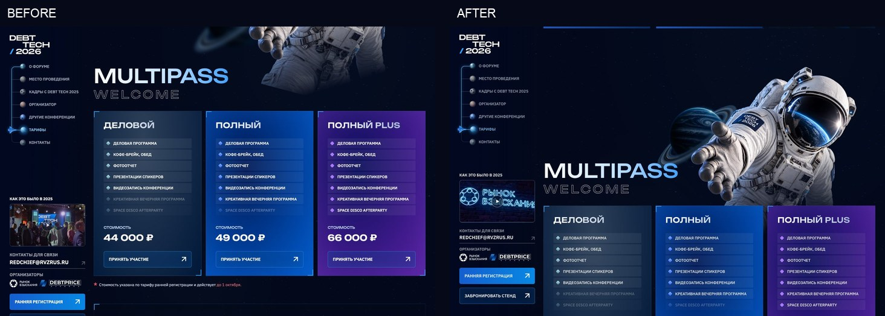
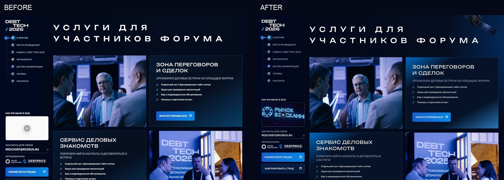
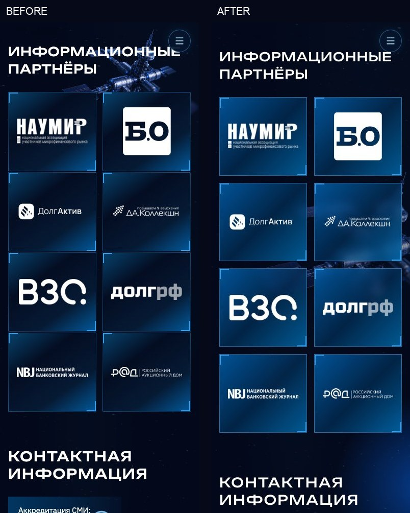

# DEBT TECH 2026 — визуальная и адаптивная проверка

29 сентября 2026. Исходная версия репозитория: `4182e12`.

Эталон: приложенный макет и исходный фрейм Figma `1129:22497`, 1440 × 17408. Задача — исправить реализацию существующего дизайна, без новой концепции. Тексты, актуальные цены, состав тарифов, сроки регистрации и договорённости по формам сохранены.

## Что исправлено

| Область | Изменение |
| --- | --- |
| Тарифы | Убрана отрицательная привязка космонавта относительно входа в раздел. Теперь шлем целиком появляется при переходе к `#tariffs`, нижняя часть иллюстрации уходит за карточки. Планета, заголовок и свободное пространство согласованы на разных ширинах. |
| Первый экран | Убрана дублирующая десктопная кнопка внутри hero. Основная регистрация в левом меню сохранена. На мобильных CTA первого экрана остаётся. |
| Фотографии и сетка | Пропорции блока «О форуме», фотографии карточек программы и размеры пар «фото / текст» масштабируются вместе с контейнером. Исправлена промежуточная десктопная сетка около 1181 px. |
| Услуги | Восстановлен спутник из исходного макета, с прозрачным фоном. Возвращены угловое свечение и более близкие к макету заливки. Исправлен ритм заголовков, текста и изображений. |
| Типографика | Исправлено сглаживание шрифтов на macOS, размеры подписей и текста карточек, неудачные разрывы слов. Bounded по-прежнему используется прописными. |
| Аудитория | Десктопная диагональная композиция с ракетой сохранена. На планшетах убраны пустые ячейки, а подписи помещаются целиком. |
| Организатор | Контакты больше не спорят с заголовком. На небольших экранах карточки растут по содержимому. Исправлено вертикальное переполнение и отдельная проблема процентных интервалов в WebKit. |
| Информационные партнёры | Декор на телефоне перенесён ниже заголовка. Высота строк сетки определяется карточками, а не прежними фиксированными 145 px. Между карточками восстановлены интервалы. |
| Видео и контакты | Вместо фоновой загрузки внешнего плеера меню показывает стабильное превью; плеер открывается по запросу. Повышена читаемость ссылок внизу, увеличены мобильные зоны нажатия и размер текста полей. |
| Ошибки отправки | При сетевом сбое форма сохраняет данные и показывает русское сообщение без ложного подтверждения отправки. Для корпоративной заявки добавлена ссылка связи с организатором. |

## Проверки

**72 из 72 комбинаций браузера и ширины прошли геометрическую проверку.** Chromium 154.0.8037.58, Firefox 153.0 и WebKit 26.6. Полные машиночитаемые результаты: [browser-matrix.json](visual-audit/browser-matrix.json).

Проверенные ширины: 320, 360, 390, 430, 599, 600, 699, 700, 767, 768, 849, 850, 899, 900, 1024, 1180, 1181, 1280, 1366, 1440, 1600, 1920, 2048 и 2560 px.

Проверялись горизонтальное переполнение, вертикальное обрезание текста, загрузка и пропорции изображений, положение космонавта относительно якоря, ошибки JavaScript и отсутствие фонового видеоплеера. Разделы дополнительно просмотрены по браузерным снимкам.

Пройдены 4 модульных теста и 32 уникальных E2E-сценария — основной прогон и финальные регрессионные проверки. Они включают меню, переключатель программы, формы и согласие, сохранение тарифа, расчёт скидок, обработку ошибок, видео, галерею, карточки других конференций, размеры CTA, отсутствие столкновений карточек и мобильные поля. Отправка заявок проверяется перехватом запросов: настоящие тестовые заявки организаторам не отправлялись.

Существующий CI выполняет расширенный набор E2E-тестов. Дополнительная проверка трёх движков и снимки разделов воспроизводятся командой `npm run audit:visual`; настройки workflow не изменялись.

## Сравнения

### Тарифы: вход в раздел и расположение иллюстрации

### Услуги: изображения, типографика и заливки

### Мобильные информационные партнёры

Сравнения показывают отдельные браузерные окна, а не реконструкцию всей страницы. Надпись BEFORE относится к прежней опубликованной версии, AFTER — к доработанной.

## Внешнее ограничение формы на GitHub Pages

Прямой OPTIONS-запрос к `https://www.debt-tech.ru/api/lead` с Origin `https://imonsergey.github.io` вернул 204 без заголовка `Access-Control-Allow-Origin`. Поэтому для реальной отправки JSON-заявок с Pages требуется разрешение этого домена на сервере заявок. Вёрстка не может выдать себе такое разрешение. Сервер и основной домен в рамках этой работы не изменялись; интерфейс не сообщает об успешной отправке при ошибке.

## Границы проверки

Это браузерная проверка адаптивов и движков, не физический прогон на всех моделях телефонов. Проверены перечисленные ширины и критические границы переключения сеток. Снимки выполнялись с уменьшенным движением для стабильной оценки расположения элементов; поведение переключателей, галерей и модальных окон проверялось отдельно.
